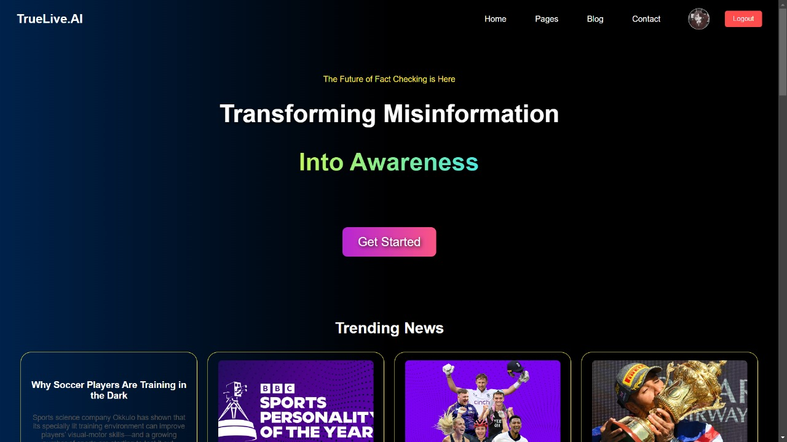
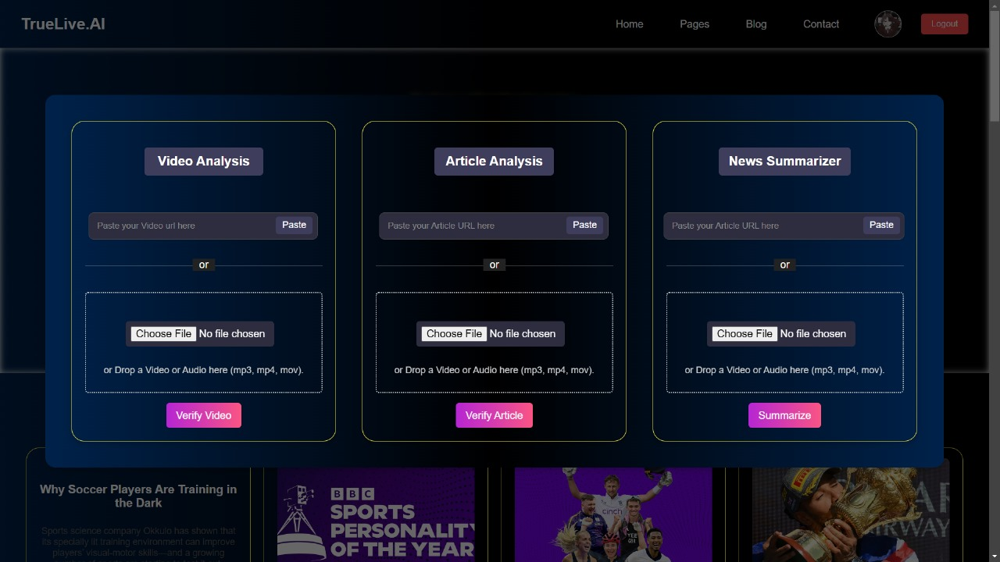
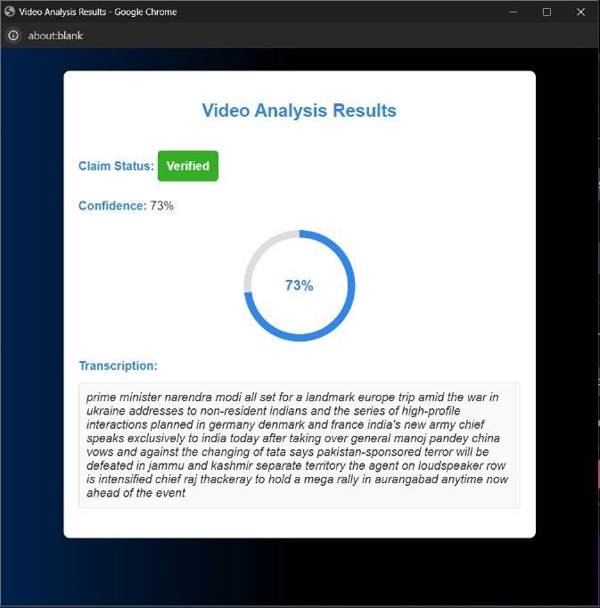

# Truelive.ai

**Truelive.ai** is an innovative platform that leverages AI and machine learning to verify the authenticity of multimedia content in real-time. The project includes tools for **verifying video, audio, and written articles**, using advanced models like **Automatic Speech Recognition (ASR)** and claim detection. With features like **news summarization** and real-time decision-making, Truelive.ai empowers users to assess the credibility of news and media content quickly and efficiently, combating misinformation in the digital world.
<br>
<br>

<p align="center">
  
</p>


### Table of Contents

- [Features](#features)
- [Usage](#usage)
- [AI Pipeline for News Verification](#ai-pipeline-for-news-verification)
- [Installation](#installation)
- [License](#license)

---

### Features

1. **Verify Multimedia Content**: Authenticate the credibility of video and audio files.
2. **Article Verification**: Analyze and verify the authenticity of written articles.
3. **News Summarization**: Generate concise summaries of news articles for quick insights.
  
  
<p align="center">
  
</p>

### Usage
1. Select a video from your local device and upload it.
2. The model starts processing the video.
3. The results are provided with a claim status: **Verified** or **Unverified**.
4. The system provides a transcription of the news using ASR (Automatic Speech Recognition).

<p align="center">
  
</p>

 ### AI Pipeline for News Verification

1. **Extract Audio from Video**:<br>
   The pipeline begins by extracting the audio track from the uploaded video file.

2. **Audio Sampling with Vosk ASR**:<br>
   The extracted audio is then sampled according to the configuration of the **Vosk Automatic Speech Recognition** (ASR) system. Vosk processes the audio to convert speech into text.

   #### Vosk Model for ASR (Automatic Speech Recognition)
   - Model: [vosk-model-en-in-0.5](https://alphacephei.com/vosk/models/vosk-model-en-in-0.5.zip)

3. **Transcription for Claim Detection**:<br>
   The transcribed text from Vosk ASR is passed to the claim detection model. This model analyzes the text to determine whether the news claim is **verified** or **unverified**.

   #### News Detection Model (BA-Claim/DistilBERT)
   - Model: [ba-claim/distilbert](https://huggingface.co/ba-claim/distilbert)

4. **Verification and Confidence Score**:<br>
   Based on the claim detection model's analysis, the output is either **verified** or **unverified**, accompanied by a **confidence score**. The confidence score indicates how strongly the model believes in the accuracy of its prediction, helping assess the reliability of the news claim
   

### Installation

Follow these steps to set up the project locally:

#### Clone the Repository

```bash
git clone https://github.com/svsaurav95/True_live.ai.git
cd True_live.ai
```

#### Set Up Virtual Environment

```bash
python -m venv env
source env/bin/activate   # On Windows, use `env\Scripts\activate`
```

#### Install Dependencies

```bash
pip install -r requirements.txt
```
#### Configure Model Paths Locally 

##### Vosk Model for ASR (Automatic Speech Recognition)
   - Model: [vosk-model-en-in-0.5](https://alphacephei.com/vosk/models/vosk-model-en-in-0.5.zip)
     
##### News Detection Model (BA-Claim/DistilBERT)
   - Model: [ba-claim/distilbert](https://huggingface.co/ba-claim/distilbert)

#### Configure Environment Variables

Create a `.env` file and add necessary configurations:

```env
FLASK_APP=app.py
```

#### Run the Application

```bash
flask run
```
#### Setup Frontend
```bash
cd src 
```
Install React Dependencies 
```bash 
npm install
```
Run React App
```bash
npm start
```
#### Access the Application

```bash
Open your browser or terminal and navigate to `http://localhost:5000`.
The React app should be available at `http://localhost:3000`.
```

### License

This project is licensed under the [MIT License](LICENSE).

---

### Author

Developed by **Team Digi Dynamos**. 
For inquiries, please contact [svsaurav95@gmail.com](mailto\:svsaurav95@gmail.com).

---


